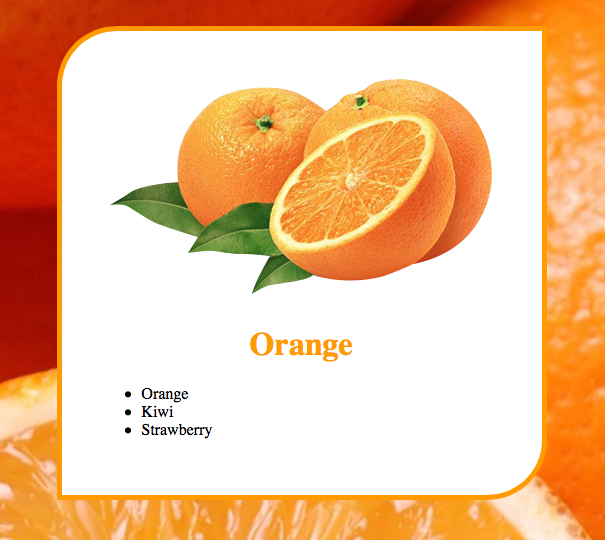

# 1일차: 처음 접하는 HTML + CSS

## 오늘의 목표
 [실습 예제](https://veam.me/example/fruit/orange.html)  


## 오늘의 공부

### `.html` : 웹 페이지 구조/형식(컴퓨터와의 대화, 시각적 디자인과 무관)

### html 문서 생성
1. Brackes를 연다
2. File -> Open Folder
3. 왼쪽 사이드바에서 새 파일 생성 (* 확장자 명 `html`을 붙여서 생성)
4. 문서 버전 명시(최신 html5 사용)
5. html 문서 작성

```html
<!DOCTYPE html>
```

> IMPORTANT: 사용자가 작성하려고하는 문서의 내용 뿐만 아니라 문서 틀까지 모두 작성한다.  

> NOTE : 오른쪽 번개모양 누르면 크롬화면에서 문서를 보여준다(실시간 반영 but, preview 버전이라 오류가 있을 수 있어서 실무에서는 잘 쓰지 않음)


### html 작성
* html은 마크업 태그로 이루어진다
* 태그: 문서의 구조/형식을 알려준다. 
* 각 마크업은 시작과 끝이 있다.
* head
	* 머리부분 
	* 실제로 눈에 보이지는 않지만 문서의 정보, 섬네일 등이 포함되어있음
	* 바디영역내에 보이지 않는 내용
 
	 ```html
	 	<head>
	 		<title>오렌지</title>
	 	</head>
	 ```
	 
* body 
	*  본문 내용 작성

	 ```html
	 	<body>

	 	</body>
	 ```

* h1~h6
	* 단계별 주제(head)를 나타내는 대제목/소제목..
	* 검색엔진은 시각적 형태와 상관없이 <h1></h1> 안에 있는 글을 중요하게 서치한다.
	
	 ```html
	 	<h1>오늘의 목표</h1>
	 ```

* ul
	* 내용을 리스트 형태로 나열할때 사용하는 태그
	*  unordered list (* dot list) // ordered list = 1,2,3...

	 ```html
	 	<ul>
	 	
	 	</ul>
	 ```
* li
	 * `ul` 내부에서 아이템 하나하나를 작성할때 사용하는 태그
	 * list item

	 ```html
	 	<ul>
	 		<li>오렌지</li>
	 		<li>바나나</li>
	 		<li>딸기</li>
	 	</ul>
	 ```

* img
	* html에서 이미지를 활용하는 태그
	* 문서에 파일(이미지)를 포함 시킬 수 없음, 파일은 각각 별도로 존재하고 서로 연결하고 호출
	* img는 닫는 지점이 없다. 무언가 컨텐츠를 담는 태그가 아니라 자기 스스로가 컨텐츠 이기 때문에(이전 html 버전에서는 로 닫는걸 강제했는데 최신버전은 닫지 않아도된다. 소속 컨벤션을 따르면된다)
	
	```html
	
	```
	
* div
	* 여러개의 태그를 그룹핑 할때 쓰는 태그
	* 검색엔진 입장에서 아무 의미가 없다. 
	* 한번에 CSS를 적용하기 위한 태그
	* div의 넓이는 화면 전체, 높이는 div에 포함된 태그의 크기

> NOTE: 태그 앞 들여쓰기를 잘 맞춰서 작성해야 구조 이해가 쉽고, 빠르게 수정할 수 있다

## `.CSS` : Cascading + Style + Sheet  
* html을 시각적으로 꾸미는 것   
* 모든 웹디자인 요소는 네모박스 모양이다 = box model = width, height, margin, padding, border  

* css 내용을 `<style>` 태그에 넣어서 html 기능과 분리
	* `<style>` 태그 안에서는 CSS의 문법을 사용한다
	* 하지만 수정할 내용이 많아지면 `style.css` 파일을 따로 관린한다
* 수정하려는 태그를 먼저 쓰고, 변경하려는 속성을 { } 내부에 작성한다. 
	* 기능별로 `;`으로 구분한다. 
	* 시각적 구분을 위해 기능 별로 엔터로 구분한다
	* 부모 태그의 속성을 바꾸면 자식 태그에도 영향을 주는 경우가있다(cascading=상속된다)
	* 속성을 작성하는 순서는 크게 중요하지 않다. 배경 이미지 > 배경 색상
	* 하지만 동일한 속성을 두번 수정할때는 아래쪽에 쓴게 적용된다
* margin
	* 컨텐츠 바깥쪽 여백 
	* `auto`를 사용하면 `div`가 사용하지 않았던 나머지 여백을 활용한다
	*  left/right margin을 모두 auto로 주면 div가 사용하지 않았던 공간을 나눠서 가지게되어 가운데 정렬된다
	* 아래 위 서로 다른 태그의 마진은 중복으로 값이 더해지지 않고 겹쳐서 나온다
* padding
	* 컨텐츠 안쪽 여백
	* 패딩값을 주면 기본 컨텐츠 사이즈에서 값이 플러스 +a로 추가된다
* border
	* 패딩이 끝나는 지점, 마진이 시작되기 전 경계부분
	* color, 선 종류, 두께를 한줄에 입력할 수 있다 (입력 순서는 상관없이 적용된다)
	
	```css
	div {
		border: 10px solid orange
	}
	```

	
* top/bottom/left/right 값을 각각 줄 수도 있지만 한줄에 쓸 수있다
	* 값 하나만 쓰면 4개 모두 적용/2개만 쓰면 상하-좌우/3개쓰면 상-좌우-하/4개 쓰면 상-우-하-좌(순서 중요)

	```css
	h1 {
		margin: 10px // 상하좌우 모두 10px
		margin: 10px 50px  // 상하 10px, 좌우 50px
		margin: 10px 50px 20px // 상 10px, 좌우 50px, 하 20px
		margin: 10px 50px 20px 30px // 상 10px 우 50px 하 20px 좌 30px
	}
	```
	
* text-align
	* 태그 내부에 포함되어있는 컨텐츠를 정렬할 때 사용한다
	* 태그 자체를 정렬할 때는 사용할 수 없다
	* 부모 태그에 적용하면 하위 자식 태그에서도 적용된다
	

### 최종 작업물
[orange.html](fruit/orange.html)


###  H.W
> 오렌지와 동일한 방식으로 키위/딸기 파일 생성(복붙 금지!!)  

* [kiwi.html](fruit/kiwi.html)  
* [strawberry.html](fruit/strawberry.html)
