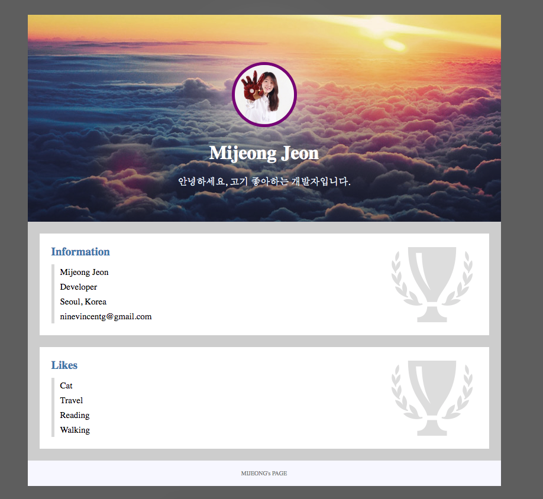

# 2일차: 선택자! 클래스의 활용

## 오늘의 목표
[실습 예제](https://veam.me/example/profile/)  


## 오늘의 공부
> TIP `command + b` = 복수 선택/수정 가능  
> Chrome 브라우저 `검사` 기능

### `html`
* 작업단위는 레이아웃 먼저 만들고 세부 내용은 나중에 채운다
* header/content/footer
	* body 내부는 일반적으로 잘 변하지 않는 header/footer와 내용이 자주 변경되는 contents 세가지 영역으로 이루어진다
* 링크
	* anchor
	* `href` 키워드로 어디로 연결할지 지정해준다
	* `target = "_blank"` 새 tab으로 띄울때 
	
	```html
	<a href="strawberry.html" target="_blank">orange</a>
	```
* p 태그
	* 문단을 나타낼 때 사용하는 태그
	* `<p>`를 여러개 쓰면 여러개 문단이 생성된다
	* 띄어쓰기를 하려면 `<br>` 태그를 활용한다
	
	```html
	<p>안녕하세요.<br>고기를 좋아하는 개발자입니다.</p>
	```
		
### `style.css`
> style이 길어지면 html과 구별하기 힘들어지기 때문에 파일을 따로 관리하고 어떤 스타일 파일을 따른건지 명시한다

```html
<link rel="stylesheet" href="style.css">
```

* 세부 조절을 위해 style.css 파일 상단에 브라우저에서 기본으로 제공하는 값을 초기화한다.
	* 브라우저마다 모두 각기 다른 초기값을 제공하는데, 리셋하기 전에 확인하는 것이 좋다
	
	```css
	ul, h2 {
	    margin: 0;
	    padding: 0;
	}
	
	li {
	    list-style-type: none;
	}
	```


### `선택자`
> CSS를 적용하려는 태그를 선택자로 선택한다(selector) 

* 태그선택자
* 전체선택자(*)
* 클래스선택자
* 하위선택자

* 클래스 선택자
	* 동일한 종류의 태그를 여러개 사용할 때 확실히 구분하기위해 이름표를 달아준다. 
	* 클래스 이름은 숫자를 포함할 수는 있지만 숫자로 시작할 수는 없다.

	```html
	<div class="wrapper">
	```

	* 사용할 때는 `태그종류.이름` `div.name` 으로 `.`으로 선택한다 (예. `전미정`)
	
	```css
	div.wrapper {
	
	}
	```
	
	* `*.name`, `.name` 으로 하면 태그 종류에 상관없이 name으로 이름으로 되어있는 모든 태그가 선택된다(예. 모든 `미정`)

	```css
	.wrapper {
	
	}
	```

* 하위 선택자
	* 어느 태그에 포함되어있는 태그인지 `띄어쓰기`로 표기한다
	
	```css
	.header h1 {
	    color: white;
	}
	```
	
	* 반복되는 태그를 한번에 수정할때는 상위 태그에 클래스를 달아서 하위 선택자로 수정한다
	
	```css
	.section li {
	    border-left: 5px solid #ddd;
	    padding: 5px 0px 3px 10px;
	    font-size: 15px;
	}
	```
	
	* 선택자를 활용하면 구조적으로 깔끔하게 정리할 수 있게한다

* `:hover` 
	* 브라우저에서 제공하는 가상클래스. 
	* 특정 상황, 지정된 상황에 맞게 적용된다
	
	```css
	.section li:hover {
	    border-color: dodgerblue;
	    color: dodgerblue;
	}
	```
	
### 최종 작업물
* [index.html](profile/index.html)  
* [style.css](profile/style.css)



### H.W.
* 원하는 페이지 만들기
* 다음주 금요일 저녁까지
