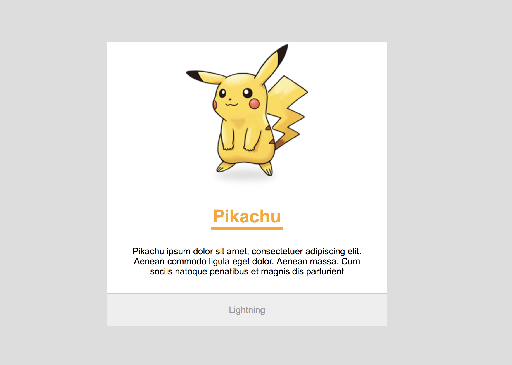
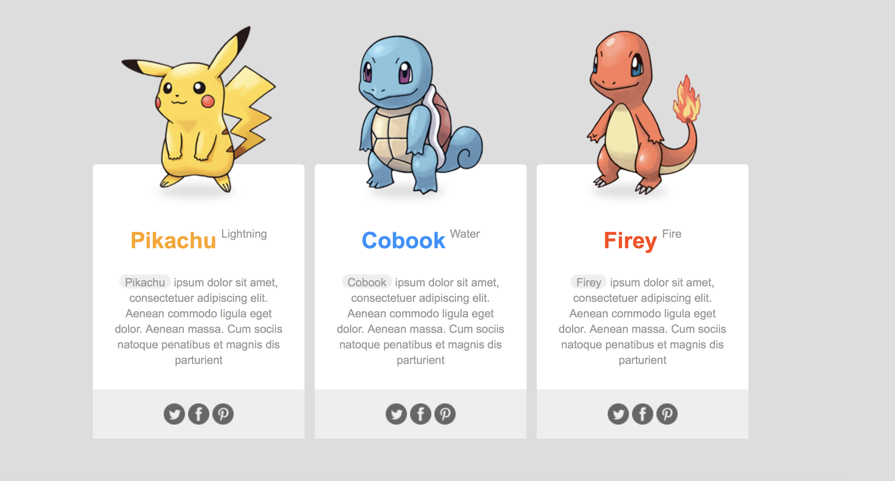
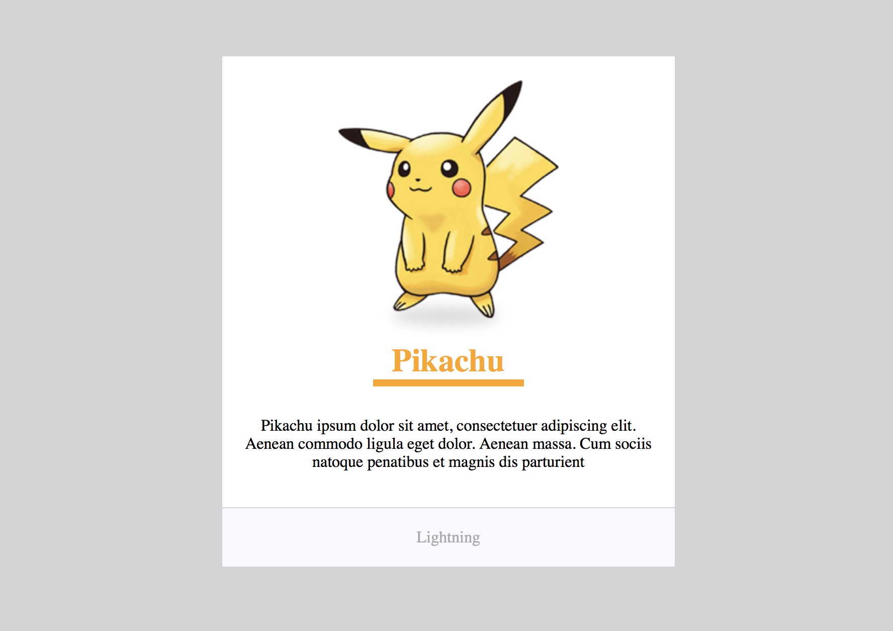

# 3일차: 선택자! 클래스의 활용

## 오늘의 목표
[첫번째 실습 예제](https://veam.me/example/day03/pokemon/)  

[두번째 실습 예제](https://veam.me/example/day03/pokemon3/)  

## 오늘의 공부

### `html`
* 태그 요소는 두가지 형식으로 이루어져 있다
	* Block-level : Box, container 개념
		* 한 줄을 다 차지한다. 
		* 대부분의 태그가 block-level이다(h1, div, p...)
	* Inline-level : Box 안에있는 컨텐츠 단위, 형광팬으로 단어를 선 긋듯 부분을 선택할 수 있다
		* 텍스트, 이미지, a 태그, span 태그
		* 컨텐츠 사이즈 만큼 자동으로 width가 설정된다(단순 width/height 설정 안됨)
		* 줄의 높이를 지정하려면 font-size를 설정하거나 line-height를 변경한다
		* margin: 좌우 마진은 적용되지만 상하 마진은 적용되지않는다(베이스라인은 지켜야한다)
		* padding: 좌우 패딩은 공간,시각 적용되지만 상하 패딩은 공간을 차지하지않는다
		* border: 인라인에서 border-bottom을 밑줄로 활용한다
* `span`
	*  linline level의 요소를 선택/수정 할 수 있게해주는 line 태그

		
### `css`
* `margin` : 마진값을 `-` 마이너스 값으로 지정하면 기준값에서 반대방향으로 움직인다
* `em` :  상대적인 단위로 값 적용하는 typotext 속성,  폰트 사이즈가 변경됨에 따라 값이 변경된다
	* font-size : 0.5em = 부모 크기의 50%으로 적용된다
* `letter-spacing` : 자간
* `text-transform` : 텍스트 대문자/소문자 변경
* `font-weight` : 텍스트 획 굵기
* `vertial align` :Inline 요소 간의 수직 관계 설정(Block-level에 적용되지 않는다)
	* `super` : 첨자
* `display` : Inline 요소를 어떻게 보여줄 것인가를 설정하는 기능
	* `block` : 일반적인 block 요소가 되어 width, height, padding, margin이 적용되고, 한 줄에 하나씩 자리를 잡는다
	* `inline-block` : 베이스 라인을 지키면서 가로정렬을 할 수 있고, width, height, padding, margin이 적용된다, 컨텐츠 만큼 width를 자동으로 조절된다
	
	
### `class`
* 하나의 태그에 여러개 class를 달 수 있다
	* class 여러개를 ` `로 구분한다
	* `
`
	* 다른 요소와 공통적인 디자인을 지니면서 세부적으로 다른 부분이 있을 때 활용
* CSS 우선순위 문제
	* 하나의 태그에 대해 같은 속성을 수정하면 뒤에 적은 속성이 반영된다
	* 하지만! 단지 태그의 종류를 선택한게 아니라 클래스명을 쓰면 그 내용이 우선반영된다
	* 구체적으로 지정해줄 수록 우선순위가 높다
	* `:hoover` 기능을 적용하려면 동일한 선택자로 선택해야한다
	
---

### 최종 작업물
#### 첫번째 작업물(개별 작업)
* [pokemon/index.html](pokemon/index.html)  
* [pokemon/style.css](pokemon/style.css)

#### 두번째 작업물(강의 속 작업)
* [pokemon-new/index.html](pokemon-new/index.html)  
* [pokemon-new/style.css](pokemon-new/style.css)

