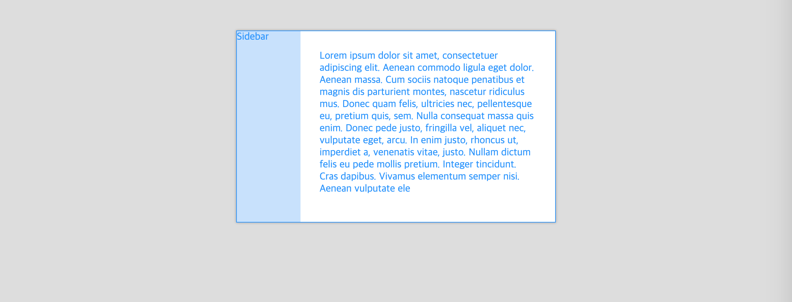
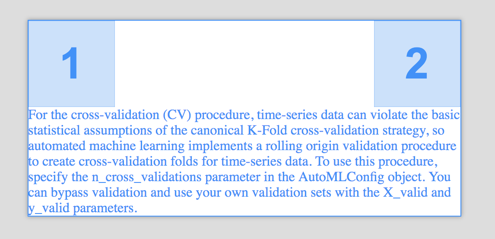
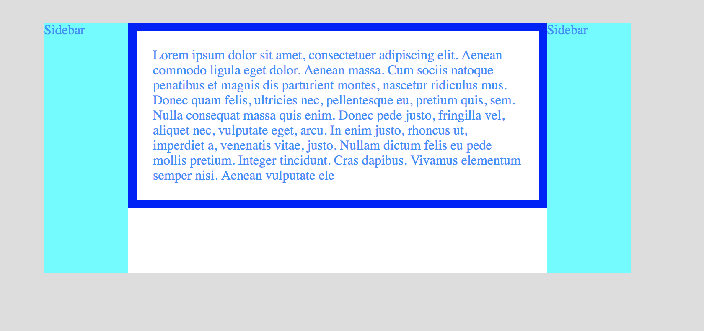

# 4일차: 레이아웃의 핵심 Float

## 오늘의 목표
### 최종 목표
[실습 예제](https://veam.me/example/wood-final/)  


### 실습 예제




## 오늘의 공부
### `html`
* 가로배치
	* Inline 요소인 `<a>` 태그를 한 줄에 넣으면 요소들 사이에 여백이 생긴다
		* 폰트 사이즈 정도의 1/4 정도(기본 폰트 사이즈: 16, 여백: 4px)
		* 베이스 라인 틀어짐과 여백 문제가 발생할 수 있다
		* 전체 틀을 잡을 때 inline 요소를 쓰면 불안한 부분이 많다

			
### `css`
* `float`
	* 가로배치하고 싶은 요소의 `css`에 `float`를 설정하면 여백없이 가로배치할 수 있다
	* 하지만 원래 가로배치를 위해 태어난 속성은 아니다
	* 남는 공간을 아끼면서, 시작점을 바꿀 수 있다
	* `float` 속성이 설정된 요소는 2층에 떠있게된다
	* 뒤따라오는 요소와 섞일 수 있게한다(순서가 중요하다)
	* 부모입장에서는 `float`된 자식의 높이를 인지하지 못해서 contents 공간에 잡히지 않는다
* `clear`
	* `float` 영향을 끊어준다
	
	```css
	p {
		clear: both
	}
	```
* `flow-root` 
	* `float`를 사용할 때 발생하는 부모 공간 영역 문제를 해결하기 위한 `display` 속성 중 하나	
	* 공간을 이미 다 알고있는 상태에서 다시 공간을 잡는다
	* !!! 하지만 Safari, Internet Explore에서 지원하지 않는다
* `overflow` 
	* 자식이 부모 공간을 벗어났을 때 어떻게 처리할 것인가에 대한 속성
	* `flow-root`를 대신해서 `overflow : hidden`으로 처리한다	
	
> 중요: [https://caniuse.com](https://caniuse.com)에서 사용할 수 있는 기능인지 확인해봐야한다!
	
### `clearfix`
	
---

### 작업물
#### 첫번째 작업물
* [float-mini/1.html](float-mini/1.html)



#### 두번째 작업물
* [float-mini/2.html](float-mini/2.html)



### 최종 작업물
* [wood/index.html](wood/index.html)
* [wood/style.html](wood/style.html)


