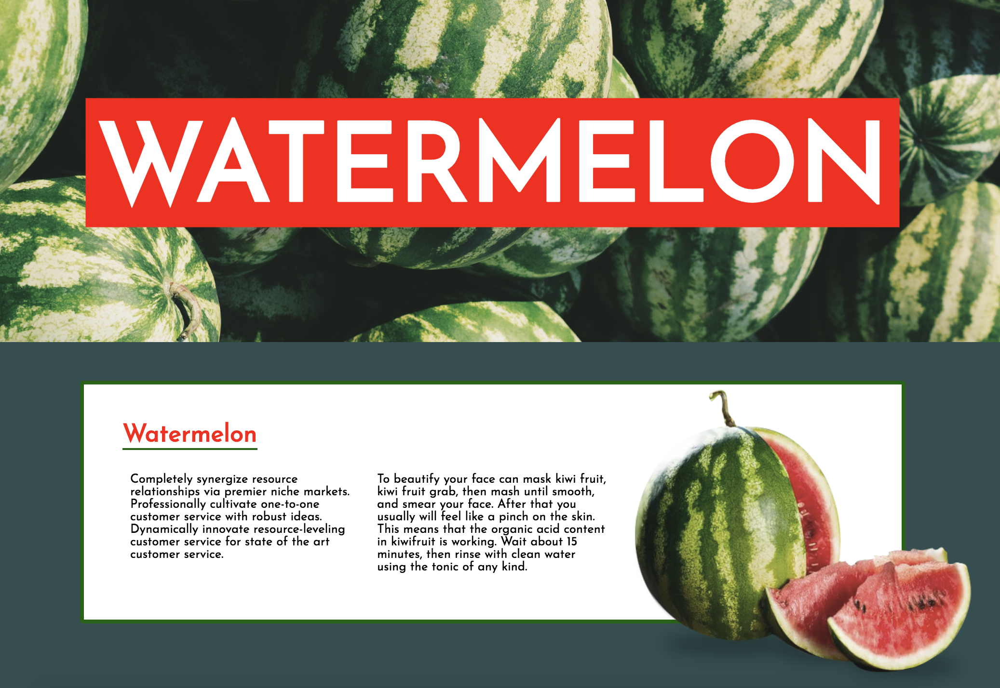

# 5일차: 레이아웃의 핵심 Position

## 오늘의 목표
### 최종 목표
[실습 예제](https://veam.me/example/fruits/orange.html)  


## 오늘의 공부	
	
### `html` 
* 웹 폰트 설정
	* 내 컴퓨터에 있는 폰트가 아니라 웹 폰트를 활용해 다른 사람들에게 동일한 폰트를 보여줄 수 있있다
	* [구글 웹 폰트](https://fonts.google.com)를 활용해서 무료로, 용량이 적은 폰트를 사용할 수 있다

	```html
	<link href="https://fonts.googleapis.com/css?family=Maven+Pro&display=swap" rel="stylesheet">
	```
	
	```css
	font-family: 'Maven Pro', sans-serif;
	```
	
### `css`
* `position` : 위치를 잡는데 사용하는 기능
	* 다양한 기준점 설정
	* 기본값은 `static`
	* `relative`: 주도권이 없고 주변 환경에 영향을 받는다
	* `absolute`: 부모에게 영향을 받지 않는다 (`float`가 2층이라면, `absolute`는 3층으로 올라갔다고 비유할 수 있다)
	* 자유도는 높지만 관리가 어려워질 수 있다
	* 부모 창의 `position`이 `static`이 아니면 자식 창이 부모 창 안에서 (상대적으로) 고정 될 수있다
	* left/right 값을 주면 위치를 변화할 수 있다
		* px값을 주면 절대값만큼 이동
		* %값을 주면 부모뷰의 사이즈의 %만큼 상대적으로 이동


```css
  .father {
                background-color: white;
                width: 300px;
                height: 200px;
                margin: 50px auto;
                position: relative;
            }
            .children {
                width: 100px;
                height: 100px;
                position: absolute;
                left: 0px;
 		}
```
	
	

```css
.grand-father {
                background-color: #bbb;
                width: 800px;
                margin: 0 auto;
                padding: 1px;
                position: relative;
            }
            .father {
                background-color: white;
                width: 300px;
                height: 200px;
                margin: 50px auto;
            }
            .children {
                width: 100px;
                height: 100px;
                position: absolute;
                left: 0px;
                bottom: 0px;
            }
```

	

```css
            .children {
                width: 100px;
                height: 100px;
                position: absolute;
                left: 50%;
                top: 50%;
                margin-left: -50px;
                margin-top: -50px;
            }
```

* `vh` : viewport height의 약자(css3)
	* 보고있는 화면을 기준으로 높이는 설정하는 단위
* 인라인 요소에 `position` 속성을 `relative`로 주면 block 요소가된다
* `transform` : 물체의 크기, 위치, 회전, 기울기 등의 속성을 조절하는 기능(css3)
	* `translate(-50%, -50%)` : `%`는 자기 자신 기준
	* 인라인 요소에는 적용되지 않는다
	
* 벤더 프리픽스: 브라우저와의 호환성에 따라 필요한 딱지
	* 인터넷 익스플로러 9 버전에서 `transform` 사용하려면 `-ms-`를 앞에 붙여줘야한다
 

---

### 최종 작업물
* [watermelon/index.html](watermelon/index.html)
* [watermelon/style.html](watermelon/style.html)




