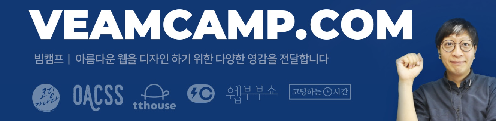
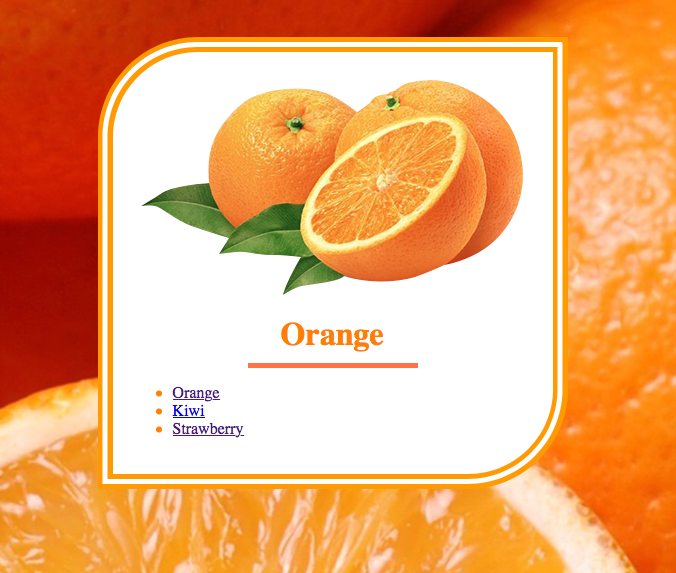
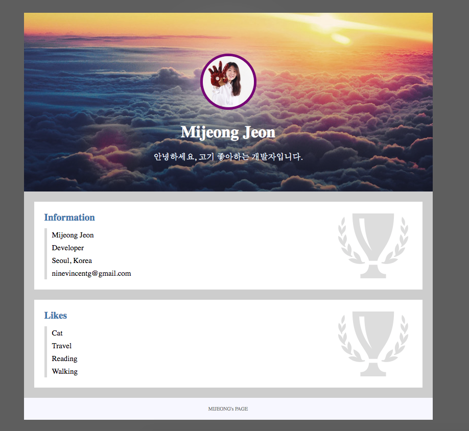
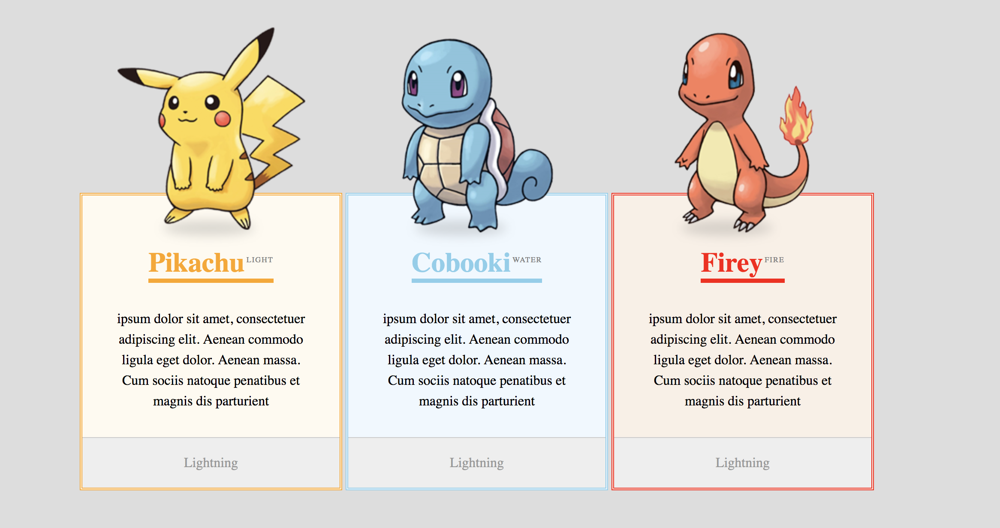
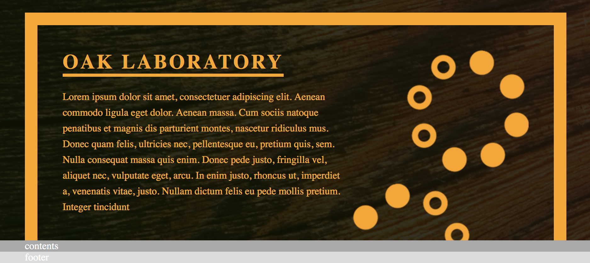
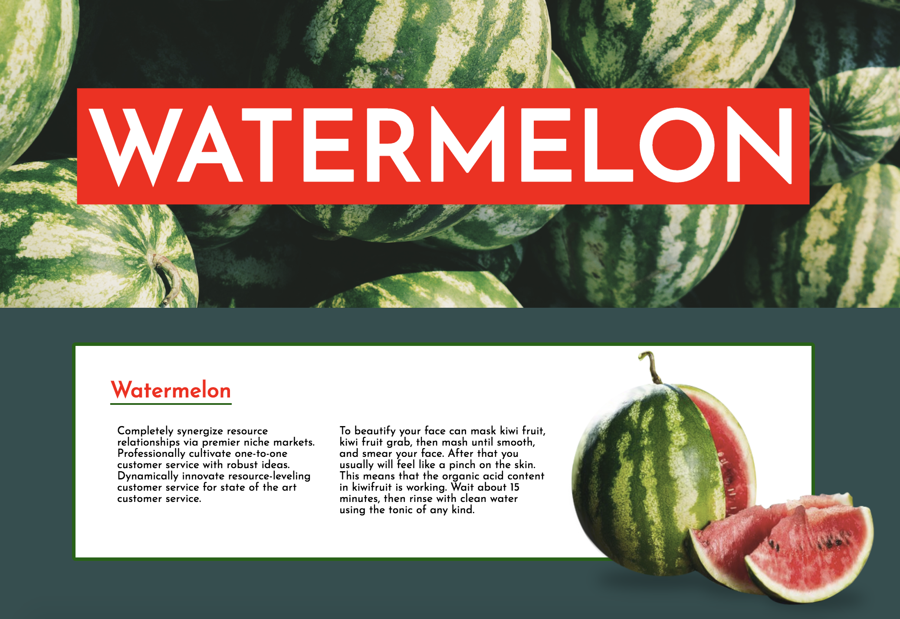

# HTML + CSS 재밌게 입문하기

=======
# HTML + CSS 재밌게 입문하기!
> 이종찬 강사님이 진행하는 **HTML + CSS 재밌게 입문하기** 수업 시간에 배운 내용을 정리하고 복습하는 공간입니다.  
> CSS는 처음이라 많이 서툴고 어지럽지만, 열공의 흔적이랍니다 📝 

### 👨🏼‍🏫 강사님 정보  

**이종찬 Glenn Lee**  
> 강의를 정말정말 꼼꼼히, 친절히, 재미있게! 잘 하시는 Glenn 강사님입니다.  HTML의 'H'와 CSS의 'S'도 모르는 제가 웹 페이지를 만들고 수정하는걸 가능하게 만들어 주신 Glenn 강사님께 깊은 감사의 마음을 남깁니다 🤗

📮 <a href="mailto: glennlee@veamcamp.com"> glennlee@veamcamp.com </a>  
👍 [https://facebook.com/glennleeee](https://facebook.com/glennleeee)  
📹 [https://youtube.com/veamcamp](https://youtube.com/veamcamp)  

---

### 📆 수업 정보
* 2019.06.22. ~ 2019.07.06.  
* 오후 2시 ~ 5시  
* 신촌 굿브라더스  
* 총 5강

---

### 💡 커리큘럼

#### 1일차: 처음 접하는 HTML + CSS
* 작업환경 셋팅하기
* 내가 만든 최초의 웹페이지
* CSS와의 첫만남
* CSS 박스모델 접하기

> [1일차 수업 정리 보러가기](1day.md)  

	
---
####  2일차: 선택자! 클래스의 활용
* 다양한 선택자(Selector)
* 클래스 선택자의 활용
* CSS 상속

> [2일차 수업 정리 보러가기](2day.md)  

### 3일차: Block과 Inline의 구분
* CSS 우선순위
* display속성 알아보기
* inline의 세계로
* inline-block으로 가로배치
* 타이포그래피 관련 속성들

>  [3일차 수업 정리 보러가기](3day.md)  

### 4일차: 레이아웃의 핵심 Float
* float란 무엇인가?
* float로 만들 수 있는 다양한 레이아웃
* float의 부작용과 해결법
* overflow속성 활용하기

>  [4일차 수업 정리 보러가기](4day.md)  

(to be updated...)

### 5일차: 레이아웃의 핵심 Position
* position이란 무엇인가?
* position으로 만들 수 있는 다양한 레이아웃
* relative와 absolute의 조합
* float와 position 최종정리

> [5일차 수업 정리 보러가기](5day.md)  
> 

